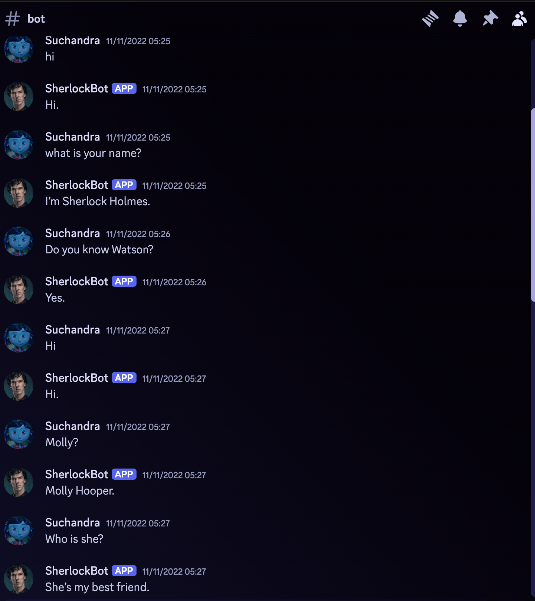

# Sherlock_bot
Title: A discord bot which converses like Sherlock Holmes.

This project demonstrates fine-tuning the DialoGPT-small model from Microsoft on a conversation dataset, parsed from BBC's Sherlock script. The model is optimized for dialogue generation and can engage in conversations as the character Sherlock.

Key Features:

Dataset Preparation: Custom ConversationDataset class for parsing dialogues and caching dataset features.
Tokenized and preprocessed input data into fixed-size blocks compatible with transformer models.

Model Fine-tuning: Fine-tuned DialoGPT-small using a Causal Language Modeling (CLM) loss function.
Implemented gradient accumulation, learning rate scheduling, and mixed-precision training with AMP.
Supported both single and multi-GPU training, with model checkpointing for saving intermediate states.

Training & Evaluation: Extensive training with dynamic batching, optimizer, and scheduler updates.
Implemented evaluation functions with options to resume from checkpoints.

